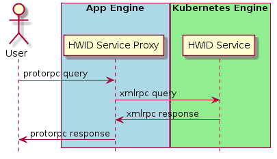

# HWID Service Manual

This folder contains source code and configurations for deploying HWID Service
to [Kubernetes Engine](https://cloud.google.com/kubernetes-engine/) and
[App Engine](https://cloud.google.com/appengine/).

## Overview



The whole HWID Service consists of two part: **HWID Service** on Kubernetes
Engine and **HWID Service Proxy** on App Engine. **HWID Service** on Kuberentes
Engine is the place that processing the logic of RPCs. We build a docker image
and runs it on the Kubernetes Engine.

### Docker Image of HWID Service

The image is built from the builder's local source code. Your source code
should have at least three repositories:

- [factory] src/platform/factory
- [chromeos-hwid] src/platform/chromeos-hwid
- [platform2] src/platform2

To build the docker image, you should type
```shell
setup/cros_hwidservice.sh -p dev build
```

**Note**: Any changes to these locations will be built into the docker image.

## HWID Service API

- **ValidateConfig**
- **ValidateConfigAndUpdateChecksum**

[TBD]

## Deploy HWID Service to Kubernetes Engine

To deploy HIWD Service, you have to use
[cros_hwidservice.sh](../../../setup/cros_hwidservice.sh).

There are three available enviroments to deploy with flag `-p`:
- **prod**: For production service.
- **staging**: For staging service.
- **dev**: Development environment.

**cros_hwidservice.sh** controls the life of the service. The major control
commands are
 - **stop**: Stop the HWID Service on Kubernetes Engine.
   ```shell
   cros_hwidservice.sh -p dev stop
   ```
 - **run**: Start the HWID Service, and creating a cluster and deployments on
   Kubernetes Engine.
   ```shell
   cros_hwidservice.sh -p dev run
   ```
 - **update**: In-place update the HWID Service docker image. In most cases, you
   should use this command, especially deploying to **prod** environment.
   ```shell
   cros_hwidservice.sh -p dev update
   ```

### Logs

To see the logs, you have to:

1. Connect to the management console
  ```shell
  cros_hwidservice.sh -p dev connect
  ```

2. Open your browser and navigates to <http://localhost:8001/ui>

3. Find label **Pods**, and press the button **Logs**

## Run HWID Service on Local Machine

```shell
cros_hwidservice.sh -p dev test
```

***

[factory]: https://chromium.googlesource.com/chromiumos/platform/factory
[chromeos-hwid]: https://chrome-internal.googlesource.com/chromeos/chromeos-hwid
[platform2]: https://chromium.googlesource.com/chromiumos/platform2
