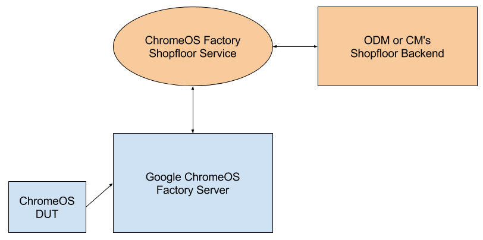

# Chrome OS Factory Shopfloor Service Specification

### History
|Version|Date      |Summary                                                   |
|-------|----------|----------------------------------------------------------|
|1.0 r1 |2017/06/20|Initial release                                           |
|1.0 r2 |2018/03/28|Define the format of `component` domain of `DeviceData`   |

[TOC]

## Introduction
The Chrome OS Factory Software Platform provides a complete solution for
manufacturing flow but there are some data that only the ODM (or CM,
contracted manufacturer) can provide, for example serial number, assigned MAC
address, SKU information, or the tracking of if a device is ready for shipment.
These are usually controlled by the proprietary "shopfloor system" developed by
ODM and installed only in manufacturing line. As a result, this must be
integrated with the Chrome OS Factory Software Platform.

Different ODMs may implement the shopfloor system in totally different
technology, for example using SQL database, web service, or data exchange via
CIFS. In order to minimize integration effort and allow most flexibility for
partners to choose how the shopfloor system is implemented, Chrome OS Factory
Software Platform has defined one virtualized layer of shopfloor, named as
"Chrome OS Factory Shopfloor Service" (abbreviated as "Shopfloor Service" in
this document).

ODM or CM should implement and maintain the Shopfloor Service to support the
interface defined in this document. The service does not need to be
open-source nor uploaded to Chrome OS private board overlays source repository.
The host running service can be a dedicated server running any OS (Windows,
Linux, etc) or simply the one running Chrome OS Factory Server (can be either
the legacy server or Umpire & Dome servers). DUTs (Device Under Test) will reach
the Shopfloor Service via a bridge inside Chrome OS Factory Server.

## Network Topology


A typical setup includes 4 components:
 - Device Under Test (DUT, a Chrome OS Device being manufactured)
 - Google Chrome OS Factory Server (a server program running on Linux machine)
 - Chrome OS Factory Shopfloor Service (A web service maintained by ODM or CM)
 - ODM or CM's Shopfloor Backend (The real shopfloor system by ODM or CM).

DUT and Google Chrome OS Factory Server (elements in blue color in diagram) are
running code maintained in Google Chrome OS source tree, while Chrome OS Factory
Shopfloor Service and Shopfloor Backend (elements in orange color in diagram)
are running code maintained by ODM or CM.

For deployment, partner may choose to run Shopfloor Service on same machine
running Google Chrome OS Factory Server, on a dedicated Windows or Linux
machine, or even directly on the backend. The Google ChromeOS Factory Server
just needs to know the URL to Shopfloor Service.

## Setting shopfloor service URL for factory server
After [Factory Server](../../setup/FACTORY_SERVER.md) is properly installed,
open the [Dome](../dome/README.md) web interface to setup shopfloor service URL
for [Umpire](../umpire/README.md):

1. Open Dome UI (for example, browser `http://<dome_host>:8000`).
2. Login and select your project.
3. In Dashboard, find `shopFloor` in Services list.
4. Change the `serviceUrl` to the right value.
4. Click `DEPLOY`.

Umpire will automatically translate `localhost` to **Docker host IP** when
Docker environment is detected. Otherwise, it would keep its original meaning
(usually solved to `127.0.0.1`). However, Umpire doesn't translate URLs using
numeric IPs like `http://127.0.0.1:8000`, so that can be used to refer to Docker
container itself (if you really want to do this, although that is usually
wrong).

## Shopfloor Service API
The "Chrome OS Factory Shopfloor Service" must be implemented as a web service
using [XML-RPC](http://xmlrpc.scripting.com/spec.html) protocol with
[Nil Extension](https://web.archive.org/web/20050911054235/http://ontosys.com/xml-rpc/extensions.php).

The default recommended port is **8090**.

An example implementation of Shopfloor Service in Python can be found
[here](shopfloor_service.py).

An example for how to access Shopfloor Service in Python:

```py
  # python 3 only
  import xmlrpc.client

  service = xmlrpc.client.ServerProxy('http://localhost:8090', allow_none=True)
  print('Service Version: %s' % service.GetVersion())

  service.NotifyStart({'serials.mlb_serial_number': '123'}, 'SMT')
```
We also support Shopfloor Service implemented in
[JSON-RPC](http://www.jsonrpc.org/) or [SOAP](https://www.w3.org/TR/soap/) via
[WSDL](https://www.w3.org/TR/wsdl).

To use JSON-RPC service, add a ``jsonrpc:`` prefix when you setup the URL in
Chrome OS Factory Software, for example ``json:http://192.168.0.1:8090``. To use
WSDL, prefix ``wsdl:``, or make sure your URL ends with ``wsdl``, for example
``http://192.168.0.1:8070?wsdl``.

To verify the server is working properly, use the ``webservice_utils`` module:

```py
  from cros.factory.utils import webservice_utils

  url = 'jsonrpc:http://192.168.0.1:8090'
  service = webservice_utils.CreateWebServiceProxy(url)
  print(service.GetDeviceInfo({}))
```

If you implement the Shopfloor Service in WSDL+SOAP and found that it is pretty
difficult to describe the data structure in parameter and return value (because
they are actually [Generic Compound Types](https://www.w3.org/TR/2000/NOTE-SOAP-20000508/#_Toc478383521)),
there is a special way to implement your service to apply JSON serialization for
all input arguments and return value. To do that, prefix a ``json:`` in your
shopfloor service URL and use ``webservice_utils`` to verify. For example:

```py
  # python 3 only
  import xmlrpc.client

  from cros.factory.utils import webservice_utils

  # Assume your real shopfloor service is here, and all its input and output
  # must be JSON strings:
  real_url = 'http://192.168.0.1:8090'
  proxy = xmlrpc.client.ServerProxy(real_url)

  # The input is a JSON string. The output is also JSON, for example
  # '{"vpd.ro.region": "us"}'
  print(proxy.GetDeviceInfo('{}'))

  # The webservice_utils provides 'json:' prefix to filter that.
  url = 'json:http://192.168.0.1:8090'
  service = webservice_utils.CreateWebServiceProxy(url)

  # Input is real variable, and output is real dict, for example
  # {'vpd.ro.region': 'us'}
  print(service.GetDeviceInfo({}))
```

### Data Format: FactoryDeviceData
Most Shopfloor Service functions need a special mapping data structure (`struct`
in XML-RPC, or `dict` in Python) named `FactoryDeviceData`. All members should
be scalar values.

The member names (or keys of dict) are made in hierarchy like "domain names" -
i.e., built with multiple components and concatenated by period ".".
For example, `factory.end_SMT` is a valid key name with `factory` as its top
domain and `end_SMT` is the component name for member.

The `FactoryDeviceData` contains only following members:
 - `serials`: A domain with serial numbers for different components. A typical
    Chromebook should at least support:
   - `serials.serial_number`: Serial number of device (printed on case).
   - `serials.mlb_serial_number`: Serial number of main logic board (mainboard).
 - `hwid`: A value for system [HWID](../hwid) if already provisioned.
 - `factory`: A domain with all manufacturing flow generated data. This can be
     used by shopfloor backend to add its own needed data for flow control.
     Most Shopfloor Service APIs will also track what has been invoked here,
     for example:
   - `factory.end_SMT`: Set to true to indicate the SMT tests are done.

Other fields are not included on purpose, for reducing unnecessary traffic,
security and privacy concern. For example, VPD values (especially ECHO codes or
registration codes) should never be included.

### Data Format: DeviceData
The `DeviceData` is the structure for return value of Shopfloor Service function
calls. The DUT Software will update Device Data (a special dictionary style
storage maintained by [`cros.factory.test.device_data`](../test/device_data.py)
using `GetDeviceData` and `UpdateDeviceData` calls).

It is based on `FactoryDeviceData`, plus few extra domains that DUT won't send
back to Shopfloor Service for privacy and performance issues:

 - `vpd`: A domain for setting Vital Product Data. There are two sub domains -
   `ro` and `rw`. For example, `vpd.ro.region` should be set to the region
   code of shipping country. Chrome OS devices should follow
   [VPD Field Requirements](https://www.google.com/chromeos/partner/fe/docs/factory/vpd.html)
   to setup required VPD values, including:
   - `vpd.ro.region`: The region code (combination of locale, timezone and
       keyboard layout, also used for WiFi regulatory) as specified from
       Chrome OS region database.
   - `vpd.rw.ubind_attribute`: "User" registration code.
   - `vpd.rw.gbind_attribute`: "Group" registration code.
 - `component`: An optional domain to specify the SKU information.  To specify
     the number of the specific installed hardware peripheral, use a field in
     below format:
     ```
     component.has_<peripheral_name> = True |  # The DUT has exactly one that
                                               # peripheral.
                                       False |  # The DUT doesn't have that
                                                #     peripheral.
                                       <number>
     ```
     For example, if the DUT has two cameras (rear camera + front camera), the
     device data should contain `component.has_camera = 2`.  If the DUT has
     only one single camera, both `component.has_camera = 1` and
     `component.has_camera = True` are valid.

*** note
**Note: There is no need to specify "device serial number" in vpd domain
(`ro.vpd.serial_number`) because that will be automatically derived from
`serials.serial_number`.
***

### Method: GetVersion
Returns the version of supported protocol.

    Parameters:
      None

    Returns:
      A string for protocol version. "1.0" for current specification.

    Example:
      GetVersion() # Returns "1.0"

All Shopfloor Service implementations following this specification should return
string `1.0`.

### Method: NotifyStart
Notifies shopfloor backend that DUT is entering a manufacturing station.

    Parameters:
      - data: A struct FactoryDeviceData representing DUT information.
      - station: A string (case-sensitive) as name of station.

    Returns:
      A struct DeviceData for values to update in the device_data.GetDeviceData.

    Example:
      NotifyStart({'serials.mlb_serial_number': 'C123'}, 'SMT')
      # Returns {} and device_data.GetDeviceData('factory.start_SMT') is True.

A Shopfloor Service implementation for typical Chromebook usually need to
support at least following stations, which is defined by reference test lists:

 - SMT: Test in Surface Mount Technology station, to verify main board.
 - FAT: Final Assembly Test.
 - RUNIN: Run-In Test.
 - FFT: Final Functional Test.
 - GRT: Google required Test.

For projects that don't plan to do some of the test stations above, they can
simply pass and return empty data for that station. Some projects may also
choose to add additional stations, but then they have to modify and maintain
their own test lists.

When success, DUT software calling this API should automatically set a
`factory.start_<station>` value in `DeviceData` to True.

### Method: NotifyEnd
Notifies shopfloor backend that DUT is leaving a manufacturing station.

    Parameters:
      - data: struct FactoryDeviceData
      - station: string (case-sensitive)

    Returns:
      A struct DeviceData for values to update in the device_data.GetDeviceData.

    Example:
      NotifyEnd({'serials.serial_number': 'A123'}, 'FAT')
      # Returns {} and device_data.GetDeviceData('factory.end_FAT') is True.

Similar to `NotifyStart` - see that for details about station names.

When success, DUT software calling this API should automatically set a
`factory.end_<station>` value in `DeviceData` to True.

*** note
**Note**: we've explicitly restricted this function to not sending extra
arguments about test results. Ideally test result collection should be done by
logging systems (for example, the `TestLog` in Chrome OS Factory Software) and
analyzed separately. If you need to change test flow according to test results,
see `UpdateTestResult`.
***

### Method: NotifyEvent
Notifies shopfloor backend that the DUT has performed an event, usually a check
point.

    Parameters:
      - data: struct FactoryDeviceData
      - event: string (case-sensitive)

    Returns:
      A struct DeviceData for values to update in the device_data.GetDeviceData.

    Example:
      NotifyEvent({'serials.serial_number': 'A123'}, 'Finalize')

      Returns {} and device_data.GetDeviceData('factory.event_Finalize') is
      True.

When success, DUT software calling this NotifyEvent should automatically set a
`factory.event_<event>` value in `DeviceData` to True.

A Shopfloor Service implementation for typical Chromebook need to accept at
least following events:

#### Finalize
Indication that DUT has been finalized, wiped and ready for shipment.

The `data` argument should not contain fields with privacy concern, for example
MAC address or registration codes. If you need to verify those values, write a
dedicated test for it.

#### Refinalize
Indication that DUT has been sent to Outgoing Quality Control (OQC) and now
back for reset and wipe.

The `data` argument should not contain fields with privacy concern, for example
MAC address or registration codes. If you need to verify those values, write a
dedicated test for it.

### Method: GetDeviceInfo
Gets information about the expected configuration for a DUT.

    Parameters:
      - data: struct FactoryDeviceData

    Returns:
      A struct DeviceData for values to update in the device_data.GetDeviceData.

    Example:
      GetDeviceInfo({'serials.mlb_serial_number': 'C123'})
      # Returns {'serials.serial_number': 'A1234', 'vpd.ro.region': 'us'}

Communicates with the backend shopfloor server, and obtains information about
the expected configuration of the device, for example VPD values or SKU and
component information.

### Method: ActivateRegCode
Notifies shopfloor backend that the DUT has deployed a registration code (also
known as ECHO codes) successfully.

    Parameters:
      - ubind_attribute: A string for user registration code.
      - gbind_attribute: A string for group registration code.
      - hwid: A string for HWID of the DUT.

    Returns:
      A struct DeviceData for values to update in the device_data.GetDeviceData.

    Example:
      ActivateRegCode('uuu', 'ggg', 'LINK A2C-B3D')

      Returns {} and device_data.GetDeviceData('factory.activate_reg_code') is
      True.

This registration code should be marked as "used" and logged on shopfloor
backend, then sent back to Google CPFE for being activated. Due to privacy
concern, this code should be *NEVER* associated with serial number and any other
data, so this function is designed very differently - no `FactoryDeviceData`.

When success, DUT software calling this API should set a
`factory.activate_reg_code` value in DeviceData to True.

### Method: UpdateTestResult
Sends the specified test result to shopfloor backend.

    Parameters:
      - data: struct FactoryDeviceData
      - test_id: A string as identifier of the given test.
      - status: A string from TestState (case sensitive).
      - details: (optional) A struct to provide more details test results,
        including at least one string member 'error_message' as message
        reported from the error.

    Returns:
      A struct DeviceData for values to update in the device_data.GetDeviceData.
      If a member 'action' is included, its value will be used to decide
      how to proceed with testing flow.

    Example:
      UpdateTestResult(data, 'smt.type_c_left', 'PASSED') # Returns {}
      UpdateTestResult(data, 'smt.type_c_left', 'FAILED',
                       {'error_msg': 'Unknown'})
      # Returns {'action': 're-run'}

`TestState` is defined in [cros.factory.test.state](../test/state.py)
and the `status` parameter should be one of the following values:
`PASSED, FAILED, SKIPPED, or FAILED_AND_WAIVED`.

Shopfloor may use this function to indicate what DUT should do next using the
`action` member in returned `DeviceData` struct. For example to re-run the
test, skip, or abort for fault analysis.

For most projects this can be implemented as a dummy function returning empty
dict.
